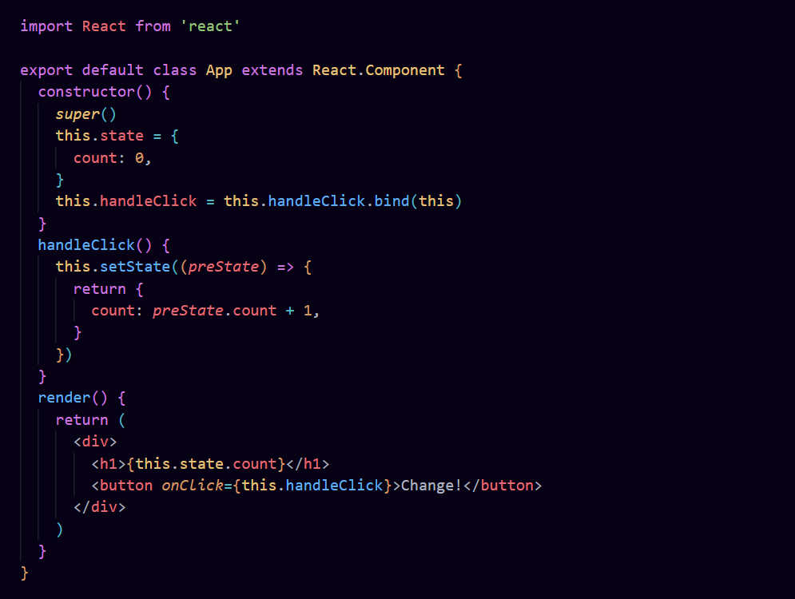
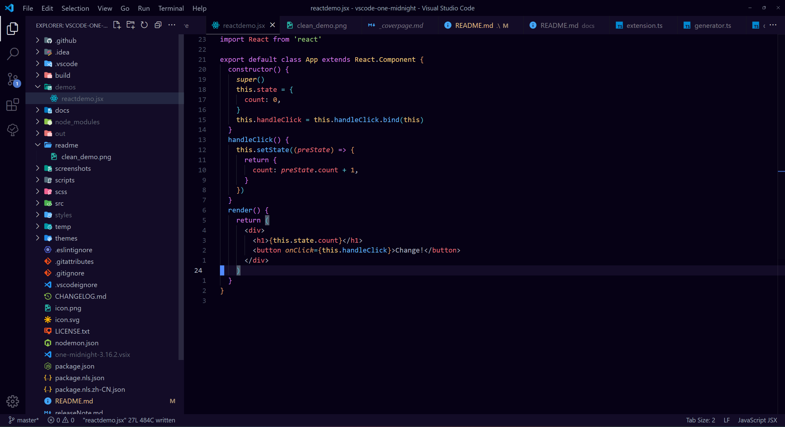

# [One Midnight for Visual Studio Code](https://marketplace.visualstudio.com/items?itemName=zhuangtongfa.Material-theme)

## [GitHub Repo](https://github.com/one-midnight-theme/vscode-one-midnight)

Atom's iconic One Dark theme, now in deep midnight blurple.

[](https://vscode.dev/theme/zhuangtongfa.Material-theme) [](https://marketplace.visualstudio.com/items?itemName=zhuangtongfa.Material-theme)

## SCREENSHOTS





## Donation

If you like this extension, you could donate to the creator of its predecessor, One Dark Pro, via **[PayPal](https://www.paypal.me/binaryify)** It will encourage them to make the original extension better and better, which will in turn make this one better!

## Markdown preview style


You can toggle whether to use markdown style in vscode setting (default use)

### Suggest Editor Settings

```json
 "editor.fontSize": 20,
 "editor.lineHeight": 30,
 "editor.fontFamily": "JetBrains Mono",
```

JetBrains Mono Download: https://www.jetbrains.com/lp/mono

### Tweaks & theming

If you want to play around with new colors, use the setting
`workbench.colorCustomizations` to customize the currently selected theme. For
example, you can add this snippet in your "settings.json" file:

```json
"workbench.colorCustomizations": {
  "tab.activeBackground": "#282c34",
  "activityBar.background": "#282c34",
  "sideBar.background": "#282c34",
  "tab.activeBorder": "#d19a66",
}
```

or use the setting `editor.tokenColorCustomizations`

```json
"editor.tokenColorCustomizations": {
  "[One Midnight]": {
    "textMateRules": [
      {
        "scope": ["source.python"],
        "settings": {
          "foreground": "#e06c75"
        }
      }
    ]
  }
}
```

#### Italic

You could set this in your setting.json to make code be italic

```json
"editor.tokenColorCustomizations": {
    "textMateRules": [
      {
        "name": "italic font",
        "scope": [
          "comment",
          "keyword",
          "storage",
          "keyword.control",
          "keyword.control.from",
          "keyword.control.flow",
          "keyword.operator.new",
          "keyword.control.import",
          "keyword.control.export",
          "keyword.control.default",
          "keyword.control.trycatch",
          "keyword.control.conditional",
          "storage.type",
          "storage.type.class",
          "storage.modifier.tsx",
          "storage.type.function",
          "storage.modifier.async",
          "variable.language",
          "variable.language.this",
          "variable.language.super",
          "meta.class",
          "meta.var.expr",
          "constant.language.null",
          "support.type.primitive",
          "entity.name.method.js",
          "entity.other.attribute-name",
          "punctuation.definition.comment",
          "text.html.basic entity.other.attribute-name",
          "tag.decorator.js entity.name.tag.js",
          "tag.decorator.js punctuation.definition.tag.js",
          "source.js constant.other.object.key.js string.unquoted.label.js",
        ],
        "settings": {
          "fontStyle": "italic",
        }
      },
    ]
  }
```

[more info](https://binaryify.github.io/OneDark-Pro)

## Python & Pylance users

Python users I recommend using [Pylance](https://marketplace.visualstudio.com/items?itemName=ms-python.vscode-pylance) extension for fast, feature-rich language support.

Semantic colors can be customized in settings.json by associating the Pylance semantic token types and modifiers with the desired colors.

- Semantic token types

  - class, enum
  - parameter, variable, property, enumMember
  - function, member
  - module
  - intrinsic
  - magicFunction (dunder methods)
  - selfParameter, clsParameter

- Semantic token modifiers
  - declaration
  - readonly, static, abstract
  - async
  - typeHint, typeHintComment
  - decorator
  - builtin

The [scope inspector](https://code.visualstudio.com/api/language-extensions/syntax-highlight-guide#scope-inspector) tool allows you to explore what semantic tokens are present in a source file and what theme rules they match to.

Example of customizing semantic colors in settings.json:

```jsonc
{
  "editor.semanticTokenColorCustomizations": {
    "[One Midnight]": {
      // Apply to this theme only
      "enabled": true,
      "rules": {
        "magicFunction:python": "#ee0000",
        "function.declaration:python": "#990000",
        "*.decorator:python": "#0000dd",
        "*.typeHint:python": "#5500aa",
        "*.typeHintComment:python": "#aaaaaa",
        "parameter:python": "#aaaaaa"
      }
    }
  }
}
```

Please check the official documentation,
[Theme Color Reference](https://code.visualstudio.com/docs/getstarted/theme-color-reference) and
[Theme Color](https://code.visualstudio.com/docs/getstarted/themes), for more helpful information.

[More info](https://code.visualstudio.com/updates/v1_15#_user-definable-syntax-highlighting-colors)

## CHANGELOG

[CHANGELOG.MD](https://github.com/Binaryify/OneDark-Pro/blob/master/CHANGELOG.md)

## DOCS & CONTRIBUTE

This document
([https://binaryify.github.io/OneDark-Pro/](https://binaryify.github.io/OneDark-Pro/))
includes instructions on how to install and edit the theme.

To help with documentation, first fork and clone this repository.

`cd` to the `OneMidnight` folder

Run `yarn`

Then run
`npm run docs` to serve the documentation
locally at `localhost:3000`.

### Contributors

This project exists thanks to all the people who contributed to the original "One Dark Pro" theme:
[](https://github.com/Binaryify/OneDark-Pro/graphs/contributors)
